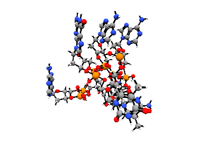

# Molecular Theory

[][1]

[![MIT License][1]][1] [![Python][2]][1] [![MD][3]][1] [![Jupyter Notebook][4]][1] [![Chemistry][5]][1]

An article written in Jupyter Notebook about Molecular Theory for the academic period 2017-I at the career of Computer Science of University of Engineering and Technology, Lima, Peru.

This notebook can be used to show some capabilities of Python and Jupyter Notebook :snake:, to explain Molecular Theory. You will see graphs in 2D and 3D.

PS: The article is written in Spanish :es:

## How to use

1. Clone the repository
    ```
    git clone https://github.com/jotarios/molecular-theory-graphed.git
    ```

2. Start the jupyter nothebook server
    ```
    jupyter notebook
    ```

3. Waits until the web browser is open, navigate to the repository directory and enjoy :smile:


## Course Detail

* **Course** : Introduction to Computer Science
* **Duration** : 16 weeks.
* **Professor** : Juan Carlos Bueno Villanueva.

## Author

* Jorge Rios ([@jotarios](https://github.com/jotarios))
* Piero Beraún ([@pierocoder](https://github.com/pierocoder))

## Licensing

All resources developed by me in this repository is released under the MIT license.

```text
    The MIT License

    Copyright (c) 2017 Jorge Rios and Piero Beraún

    Permission is hereby granted, free of charge, to any person obtaining a copy
    of this software and associated documentation files (the "Software"), to deal
    in the Software without restriction, including without limitation the rights
    to use, copy, modify, merge, publish, distribute, sublicense, and/or sell
    copies of the Software, and to permit persons to whom the Software is
    furnished to do so, subject to the following conditions:

    The above copyright notice and this permission notice shall be included in
    all copies or substantial portions of the Software.

    THE SOFTWARE IS PROVIDED "AS IS", WITHOUT WARRANTY OF ANY KIND, EXPRESS OR
    IMPLIED, INCLUDING BUT NOT LIMITED TO THE WARRANTIES OF MERCHANTABILITY,
    FITNESS FOR A PARTICULAR PURPOSE AND NONINFRINGEMENT. IN NO EVENT SHALL THE
    AUTHORS OR COPYRIGHT HOLDERS BE LIABLE FOR ANY CLAIM, DAMAGES OR OTHER
    LIABILITY, WHETHER IN AN ACTION OF CONTRACT, TORT OR OTHERWISE, ARISING FROM,
    OUT OF OR IN CONNECTION WITH THE SOFTWARE OR THE USE OR OTHER DEALINGS IN
    THE SOFTWARE.
```

Resource with its respective licences are protectect by them.

If you find copyright protected content or without its respective credits,
please let us know to give the respective credits and to put the things in
order according to laws.

[1]: https://img.shields.io/badge/License-MIT-blue.svg?maxAge=2592000&style=flat-square
[2]: https://img.shields.io/badge/Language-Python-green.svg?maxAge=2592000&style=flat-square
[3]: https://img.shields.io/badge/Language-Markdown-lightgrey.svg?maxAge=2592000&style=flat-square
[4]: https://img.shields.io/badge/Tool-Jupyter%20Notebook-orange.svg?maxAge=2592000&style=flat-square
[5]: https://img.shields.io/badge/Topic-Chemistry-green.svg?maxAge=2592000&style=flat-square
